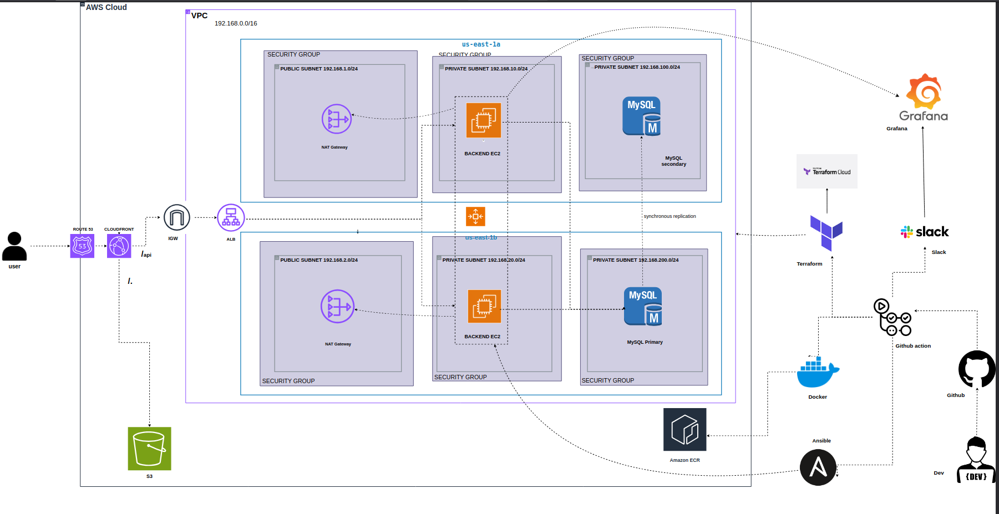

# NeuroGrid: High-Availability Cloud Infrastructure & DevSecOps Platform

An enterprise-grade, multi-tier web application and observability platform deployed on AWS using Terraform (IaC), Docker Compose, Python, and an automated GitHub Actions CI/CD pipeline.

---

## What NeuroGrid is all about

**NeuroGrid** is a distributed neural compatibility and implant assessment platform engineered with strict zero-trust security, dynamic scaling, and deep telemetry.

* **User Authentication & Anti-Abuse Engine:** Features custom Bcrypt password hashing, session-based route protection, IP-restricted rate-limiting (1 account per IP to prevent spam registration), and automatic account lockout after 3 consecutive failed login attempts.
* **Algorithmic Compatibility Engine:** Evaluates multi-variable bio-telemetry submissions (synapse speeds, rejection tolerances, cortex voltages, and nanite counts) against a weighted scoring algorithm to compute implant tiers and compatibility classifications in real time.
* **Real-Time Dynamic Telemetry:** Exposes active system health checks and runtime performance metrics (`/metrics`) using `prometheus-flask-exporter` to monitor request latencies, HTTP error rates, and active user transactions under load.

---

## Architecture Overview

 

### Key Architectural Highlights

* **Global Content Delivery:** Frontend static assets hosted in a private Amazon S3 bucket fronted by Amazon CloudFront with Origin Access Control (OAC) and automated cache invalidation.
* **Dynamic API Reverse Proxy:** CloudFront dynamically routes `/api/*` traffic directly to an Application Load Balancer (ALB) across multiple public availability zones.
* **Auto-Scaling Compute Tier:** Containerized Flask application running across private subnets via an Auto Scaling Group (ASG) and Launch Template, completely isolated from direct internet access.
* **Managed Multi-AZ Database:** Amazon RDS MySQL 8.0 configured with synchronous multi-AZ standby replication across private database subnets, strictly accessible only from backend compute security groups over port 3306.
* **Zero-Trust Management (No Port 22 / SSH):** Inbound SSH is disabled. All instance configuration, remote deployments, and administrative access execute via AWS Systems Manager (SSM) and IAM roles.
* **Isolated Observability Stack:** Prometheus and Grafana run alongside Adminer, bound strictly to `127.0.0.1` on compute nodes and accessed via encrypted SSM port-forwarding tunnels.

---

## Step-by-Step Deployment Guide

### Local Prerequisites & Secrets Setup

1. **Generate Session Secret Key:**
Generate a cryptographic token for Flask session management:

```bash
python3 -c 'import secrets; print(secrets.token_hex(32))'

```

2. **Configure GitHub Repository Secrets:**
Navigate to **Settings > Secrets and variables > Actions** in your GitHub repository and define the following secrets:

* `TF_API_TOKEN`: Terraform Cloud API token for remote state backend execution.
* `AWS_ACCESS_KEY_ID`: IAM programmatic access key with provisioning permissions.
* `AWS_SECRET_ACCESS_KEY`: IAM secret access key.
* `AWS_REGION`: Target deployment region (e.g., `us-east-1`).
* `AWS_ACCOUNT_ID`: 12-digit AWS Account ID.
* `DB_USER`: Master RDS MySQL username (use `admin`; AWS reserves `root`).
* `DB_PASSWORD`: Master password for your RDS MySQL instance.
* `DB_NAME`: Database name (e.g., `neurogrid_db`).
* `SECRET_KEY`: Cryptographic secret string generated for Flask session integrity.

---

### Automated Deployment Execution

Commit and push your code to the `dev` branch:

```bash
git add .
git commit -m "feat: complete production infrastructure and app deployment"
git push origin dev

```

Upon push, GitHub Actions automatically executes the four pipeline phases:

1. **Terraform Provisioning:** Builds the VPC network topology (6 subnets across 2 AZs), NAT Gateways, ALB, Multi-AZ RDS, Launch Templates, Auto Scaling Group, S3 bucket, CloudFront distribution with OAC, and ECR repository.
2. **Frontend Deployment:** Synchronizes `./frontend` static build assets to the private S3 bucket and triggers a global CloudFront cache invalidation (`/*`).
3. **Container Build & Registry Push:** Builds the production backend Docker container and pushes it to Amazon ECR tagged as `neurogrid-backend:latest`.
4. **ASG Orchestration via AWS SSM:**

* Packages `docker-compose.yml`, `init.sql`, and `monitoring/` into a base64 deployment bundle.
* Targets all instances in the Auto Scaling Group dynamically via AWS Systems Manager (`aws:autoscaling:groupName`).
* Injects environment variables into `/home/ubuntu/app/.env`.
* Authenticates Docker against Amazon ECR, pulls the latest backend image, and starts services with `docker compose up -d --remove-orphans`.

---

### Accessing the Application

1. **Public Web Application:**
Retrieve the CloudFront domain name from your Terraform outputs or the AWS Console:

```text
https://<CLOUDFRONT_DISTRIBUTION_DOMAIN>

```

* Accessing `/` serves the S3-hosted Single Page Application (SPA).
* Authentication and dynamic assessment requests (`/api/*`) route transparently through the ALB to backend compute instances.

---

## Secure Operational Access via AWS SSM

Because ports `3000` (Grafana), `9090` (Prometheus), and `8080` (Adminer) are bound to `127.0.0.1` and SSH port 22 is disabled, open encrypted tunnels from your local terminal using the AWS CLI(that is you must have awscli install on your local machine and authenticated with administrationacess or least priveldege acess for security purpose) and target instance ID:

```bash
# Retrieve an active instance ID from the Auto Scaling Group
INSTANCE_ID=$(aws autoscaling describe-auto-scaling-groups \
  --auto-scaling-group-names <AUTOSCALING_GROUP_NAME> \
  --query "AutoScalingGroups[0].Instances[0].InstanceId" \
  --output text)

```

### 1. Access Grafana Dashboard (Port 3000)

```bash
aws ssm start-session \
  --target $INSTANCE_ID \
  --document-name AWS-StartPortForwardingSession \
  --parameters '{"portNumber":["3000"],"localPortNumber":["3000"]}'

```

* **URL:** `http://localhost:3000`
* **Default Credentials:** User: `admin` | Password: `${GRAFANA_PASSWORD:-admin}`

### 2. Access Adminer Database Manager (Port 8080)

```bash
aws ssm start-session \
  --target $INSTANCE_ID \
  --document-name AWS-StartPortForwardingSession \
  --parameters '{"portNumber":["8080"],"localPortNumber":["8080"]}'

```

* **URL:** `http://localhost:8080`
* **System:** `MySQL` | **Server:** `<RDS_ENDPOINT>` | **User:** `admin` | **Database:** `neurogrid_db`

### 3. Access Prometheus Metrics Server (Port 9090)

```bash
aws ssm start-session \
  --target $INSTANCE_ID \
  --document-name AWS-StartPortForwardingSession \
  --parameters '{"portNumber":["9090"],"localPortNumber":["9090"]}'

```

* **URL:** `http://localhost:9090`

---

## Infrastructure Teardown

To clean up all AWS cloud resources and prevent ongoing charges:

1. **Empty the Frontend S3 Bucket:**

```bash
aws s3 rm s3://<FRONTEND_S3_BUCKET_NAME> --recursive

```

2. **Destroy Provisioned Infrastructure:**
Run Terraform destroy locally or execute a destroy workflow run:

```bash
terraform destroy -auto-approve

```
